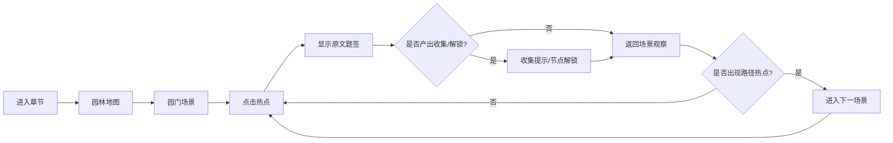

# 首个 Vertical Slice UI 信息架构表

适用范围：第一章“刘姥姥进大观园”的首个可玩切片：园门、潇湘馆、宴席戏眼。

目标：定义玩家在地图、场景、热点、原文文本、收集册和短选择之间如何流动。此表用于产品、UI、前端和叙事策划对齐，不是最终视觉稿。

## UI 总原则

- 沉浸场景优先，UI 退到边缘。
- 玩家可见文学文本使用《红楼梦》原文，UI 只承担承载、导航、状态提示，不替原文解释。
- UI 风格服务“戏台梦境”：题签、戏牌、帘幕、册页、印记、灯影，而不是现代任务面板。
- 常驻 UI 尽量少，核心画面留给场景、人物和可点击热点。
- 所有交互都要能用鼠标/触屏完成，首版不依赖键盘快捷键。

## 信息层级

| 层级 | 内容 | 玩家关注点 | UI 承载方式 |
| --- | --- | --- | --- |
| L1 主体验 | 当前场景画面 | 我在哪里、能看什么 | 全屏场景 |
| L2 可交互层 | 人物、道具、声响、路径热点 | 哪里可以点 | 轻提示、高光、光标/触摸反馈 |
| L3 文本层 | 原文摘句 | 原文说了什么 | 底部/侧边题签文本框 |
| L4 状态层 | 解锁、收集、已读、当前节点 | 我推进了什么 | 角落小印记、收集提示 |
| L5 导航层 | 地图、返回、前往下一景 | 去哪里 | 可收起地图/路径按钮 |
| L6 资料层 | 收集册、人物回声、原文来源 | 回看材料 | 册页式面板 |

## 主流程

## 页面/面板总览

| UI 模块 | 类型 | 出现时机 | 核心功能 | 优先级 |
| --- | --- | --- | --- | --- |
| 章节入口 | 页面 | 首次进入游戏 | 进入“刘姥姥进大观园”切片 | P1 |
| 园林地图 | 页面/覆盖层 | 章节开始、场景间移动 | 查看节点、进入已解锁场景 | P0 |
| 场景画面 | 主页面 | 进入任一场景 | 承载背景、人物、热点 | P0 |
| 热点提示 | 场景内组件 | 悬停/触摸/已发现 | 提示可点击区域 | P0 |
| 原文题签框 | 文本组件 | 点击热点后 | 显示原文摘句和回目来源 | P0 |
| 短选择戏牌 | 选择组件 | 宴席戏眼触发后 | 选择观看角度，显示原文回响 | P0 |
| 收集提示 | 状态组件 | 获得收集物时 | 提示新收集 | P0 |
| 收集册 | 面板 | 玩家主动打开 | 回看原文摘句、来源、已收集内容 | P1 |
| 人物回声页 | 面板 | 获得人物回声后 | 查看角色相关原文片段 | P1 |
| 设置/声音 | 面板 | 角落按钮 | 音量、动效开关 | P2 |

## 场景画面布局

| 区域 | 内容 | 设计要求 |
| --- | --- | --- |
| 主画面 | 场景背景、人物、道具、动效 | 全屏或近全屏，避免卡片式包裹 |
| 左上角 | 当前场景题名 | 题签样式，短暂显示后可淡出 |
| 右上角 | 收集册、设置、地图入口 | 图标按钮为主，不用长文字按钮 |
| 底部 | 原文题签框 | 点击热点后出现，默认隐藏 |
| 画面边缘 | 路径热点/下一景入口 | 用灯影、石径、声纹等场景元素表现 |
| 热点位置 | 人物/道具/声响 | 悬停时轻微高光，不常驻大标签 |

## 园林地图 UI

| 元素 | 功能 | 状态 |
| --- | --- | --- |
| 地图底图 | 展示大观园节点 | 初版可用灰盒地图 |
| 节点：园门 | 已解锁起点 | 默认可进入 |
| 节点：潇湘馆 | 第二节点 | 园门石径触发后解锁 |
| 节点：宴席戏眼 | 第三节点 | 潇湘馆远处鼓乐触发后解锁 |
| 未开放节点 | 秋爽斋、蘅芜苑、醉归回廊等 | 置灰或用雾遮挡 |
| 返回当前场景 | 从地图回到刚才场景 | 若在场景中打开地图则显示 |

## 原文题签框

| 字段 | 说明 |
| --- | --- |
| 原文正文 | 直接显示《红楼梦》原文摘句 |
| 来源 | 显示“第四十回”或“第四十一回” |
| 状态 | 首次触发、已读、已收集 |
| 操作 | 关闭、加入收集册、继续 |
| 禁止 | 不在题签框里加入现代解释性改写 |

### 文本框行为

| 场景 | 行为 |
| --- | --- |
| 首次点击热点 | 题签框出现，背景不完全遮挡 |
| 重复点击热点 | 显示同一句原文或只播放音画反馈 |
| 点击空白处 | 若题签框已读，可收起 |
| 获得收集 | 题签框右上出现小印记 |

## 热点提示 UI

| 状态 | 表现 |
| --- | --- |
| 未发现 | 无明显 UI，只靠画面引导 |
| 可点击 | 悬停/触摸时出现细光边或局部亮度变化 |
| 已点击 | 热点保留轻微暗印，避免玩家迷失 |
| 关键路径 | 光影更明显，但仍应融入场景 |
| 声音热点 | 用声纹、字幕残影或画面边缘波纹提示 |

## 短选择戏牌

使用场景：宴席戏眼。

| 选项 | 对应视角 | 显示原文 |
| --- | --- | --- |
| 看刘姥姥 | 喜剧中心与应对 | “咱們哄著老太太開個心兒……” |
| 看凤姐鸳鸯 | 安排笑剧的人 | “獨有鳳姐鴛鴦二人撐著……” |
| 看众人 | 群像观看关系 | “地下的無一個不彎腰屈背……” |

### 交互规则

- 戏牌在触发刘姥姥动作和鸳鸯手势后出现。
- 首版每轮只能选择一次。
- 选择后显示对应原文摘句，剧情不分支。
- 选择结果进入收集册的“回响记录”。

## 收集册 UI

| 分组 | 内容 |
| --- | --- |
| 梦痕 | 初入园门、入园观感、宴中笑声等收集物 |
| 人物回声 | 刘姥姥、黛玉、凤姐鸳鸯、贾母等相关片段 |
| 场景题跋 | 园门、潇湘馆、宴席戏眼 |
| 原文来源 | 第四十回、第四十一回链接与版本备注 |

### 收集卡字段

| 字段 | 示例 |
| --- | --- |
| 标题 | 宴中笑声 |
| 原文 | 上上下下都哈哈的大笑起來。 |
| 来源 | 第四十回 |
| 来源热点 | 众人笑声 |
| 所属场景 | 宴席戏眼 |

## 导航与返回

| 操作 | 规则 |
| --- | --- |
| 从地图进场景 | 点击已解锁节点 |
| 从场景回地图 | 点击右上角地图图标 |
| 场景内前进 | 点击路径/声响类热点 |
| 题签框关闭 | 点击关闭图标或画面空白 |
| 收集册关闭 | 返回当前场景，不重置场景状态 |

## 状态数据需求

| 状态 | 用途 |
| --- | --- |
| currentSceneId | 当前场景 |
| unlockedSceneIds | 已解锁场景 |
| clickedHotspotIds | 已点击热点 |
| collectedItemIds | 已收集条目 |
| readTriggerIds | 已读原文触发 |
| selectedEchoId | 宴席短选择结果 |
| soundEnabled | 声音开关 |

## 首版验收标准

- 玩家能在不读说明的情况下进入园门、点击热点、看到原文、进入潇湘馆和宴席戏眼。
- UI 不遮挡场景主体，常驻元素控制在右上角和必要题签内。
- 每条原文摘句都能显示来源回目。
- 收集册能回看至少 6 条收集内容。
- 宴席戏眼能出现一次短选择，并把结果记录到收集册。
- 地图能区分已解锁、未解锁、当前场景三种状态。

